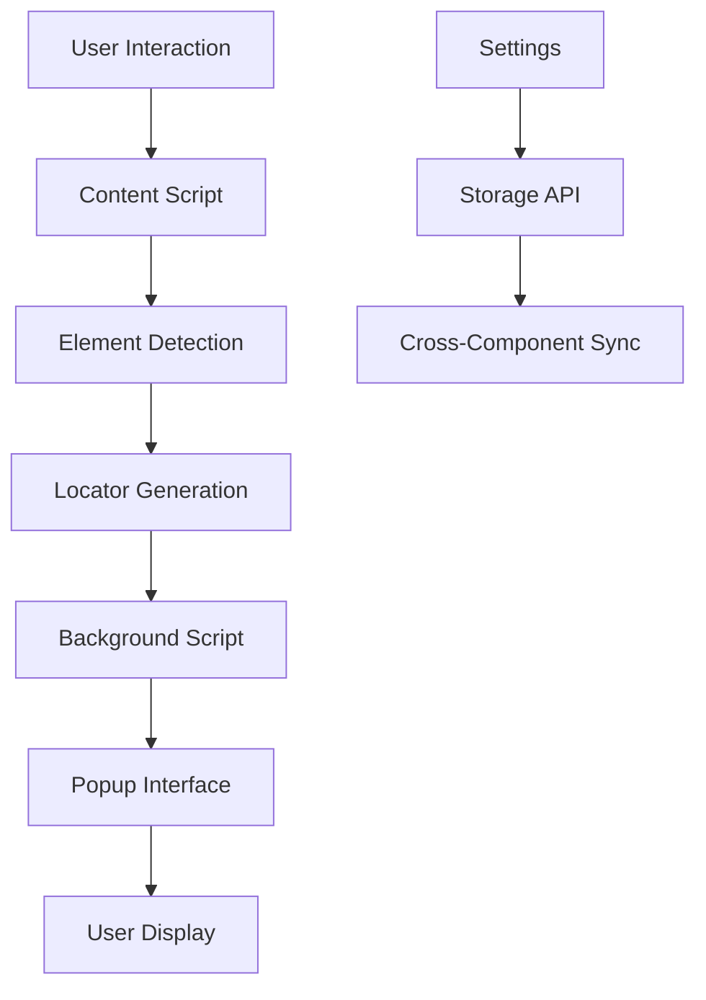

# WebLocatorHub Chrome Extension

<div align="center">


**A powerful browser extension to simplify locating unique elements within a DOM structure. Playwright supported locator genertor.**

[](manifest.json)
[](LICENSE)
[](https://developer.chrome.com/docs/extensions/)
[](https://playwright.dev/)

</div>

## 🎯 Features

### Core Functionality

- **🖱️ One-Click Element Selection**: Generate unique selectors with a single click
- **🎨 Visual Element Highlighting**: Intuitive interface with hover tooltips and element indicators
- **📋 Multiple Locator Strategies**: CSS selectors, XPath expressions, and Playwright locators
- **👁️ Interactive Preview**: Preview and validate selected elements before using locators
- **💾 Copy-Ready Code**: Instant clipboard access for development and testing workflows
- **⚡ Live Inspector**: Real-time locator generation as you hover over elements

### Advanced Capabilities

- **🏗️ Comprehensive DOM Support**: Works with iframes, Shadow DOM, SVG elements, and dynamic content
- **🎪 Cross-Frame Compatibility**: Handles nested iframes and cross-origin scenarios gracefully
- **🔍 Smart Element Detection**: Identifies dynamic elements, framework-generated content, and invisible UI components
- **🎯 Precision Targeting**: Element coordinates, dimensions, and visibility state detection
- **🧭 Advanced Relationship Selectors**: Sibling, ancestor, descendant, and axes-based locators
- **♿ Accessibility Integration**: ARIA attributes, roles, and semantic markup support

### Playwright Integration

- **🎭 Role-Based Locators**: `page.getByRole('button', { name: 'Submit' })`
- **📝 Text Content Locators**: `page.getByText('Click here')`
- **🏷️ Label Association**: `page.getByLabel('Email address')`
- **💬 Placeholder Targeting**: `page.getByPlaceholder('Enter your name')`
- **🧪 Test ID Support**: `page.getByTestId('submit-button')`
- **⚙️ Generic Locators**: `page.locator('#elementId')` with CSS and XPath

### Developer Features

- **📦 Bulk Operations**: Copy all locators with filtering options
- **📊 Element Analytics**: Detailed metadata including attributes, styles, and positioning
- **🔧 Reliability Scoring**: Color-coded reliability indicators for locator strategies
- **⚡ Performance Optimization**: Efficient selector generation with memory management
- **🎨 Customizable Interface**: Responsive design that works in popup and side panel modes
- **🔄 Live Updates**: Real-time locator refresh and validation

## 🚀 Installation

### From Chrome Web Store (Recommended)

_Coming soon - extension will be published to Chrome Web Store_

### Manual Installation (Developer Mode)

1. **Download Extension**

   ```bash
   git clone https://github.com/TheWonderApps/FindMyWebElement.git
   cd FindMyWebElement
   ```

2. **Load in Chrome**

   - Open Chrome and navigate to `chrome://extensions/`
   - Enable "Developer mode" in the top right
   - Click "Load unpacked" and select the extension folder
   - The WebLocatorHub icon will appear in your toolbar

3. **Verify Installation**
   - Click the extension icon
   - You should see the WebLocatorHub interface
   - Test on any webpage to ensure functionality

## 📖 Usage

### Basic Workflow

1. **🎯 Activate Selector**

   - Click the WebLocatorHub toolbar icon
   - Click "🎯 Activate Element Selector" button
   - Your cursor will change to targeting mode

2. **🔍 Element Selection**

   - Hover over any page element to see it highlighted
   - View quick locators in the live inspector panel
   - Click on the desired element to generate full locators

3. **📋 Copy Locators**

   - Browse generated locators organized by type
   - Use filtering options (All, CSS, XPath, Playwright, Recommended)
   - Click individual "Copy" buttons or "Copy All" for bulk operations

4. **✅ Validate & Test**
   - Use "Preview" to highlight the selected element again
   - Test locators directly in the browser console
   - Verify element selection accuracy

### Advanced Features

#### Live Inspector Mode

- **Real-time Updates**: See locators update as you hover
- **Quick Access**: Get the three most common locator types instantly
- **Smart Suggestions**: Prioritized by reliability and performance

#### Settings Configuration

- **Locator Types**: Enable/disable XPath, CSS, Playwright, and Advanced selectors
- **Interface Options**: Toggle hover tooltips, live mode, and side panel integration
- **Performance Tuning**: Adjust hover delays and batch processing

#### Keyboard Shortcuts

- **ESC**: Exit element selection mode
- **Click**: Select element and generate locators
- **Hover**: Activate live inspector (when enabled)

## ⚙️ Settings & Options

**🎯 Navigation:** Click the **gear icon (⚙️)** in the **top-right corner** of the side panel to access all settings and configuration options.

---

### Locator Configuration

#### **Enable/Disable Locator Types**

- **✅ CSS Selectors**: Toggle CSS selector generation
- **✅ XPath Expressions**: Enable/disable XPath locator creation
- **✅ Playwright Locators**: Control Playwright-specific selector generation
- **✅ Advanced Selectors**: Show/hide complex relationship selectors

#### **Locator Preferences**

- **🎯 Prioritize IDs**: Give preference to ID-based selectors
- **🏷️ Include ARIA Attributes**: Incorporate accessibility attributes
- **📋 Test ID Priority**: Prioritize `data-testid` attributes for testing
- **🔄 Dynamic Content Handling**: Smart detection of framework-generated elements

### Interface Customization

#### **Visual Settings**

- **🎨 Theme Selection**: Light/Dark mode toggle
- **📏 Panel Size**: Adjust side panel width (300px - 500px)
- **🎯 Highlight Colors**: Customize element highlighting colors
- **⏱️ Hover Delay**: Adjust tooltip and highlight timing (100ms - 1000ms)

#### **Display Options**

- **📱 Side Panel Mode**: Enable Chrome side panel integration
- **🔄 Live Inspector**: Real-time locator updates on hover
- **💡 Tooltips**: Show/hide informational tooltips
- **📊 Reliability Indicators**: Display color-coded reliability scores

### Performance Tuning

#### **Processing Settings**

- **⚡ Batch Size**: Control bulk operation processing (10-100 elements)
- **🧠 Memory Management**: Automatic cleanup intervals
- **📦 Cache Duration**: Locator caching for repeated elements (1-60 minutes)
- **🔄 Refresh Rate**: Live inspector update frequency (50ms - 500ms)

#### **Advanced Options**

- **🖼️ Cross-Frame Detection**: Enable iframe element detection
- **🌑 Shadow DOM Support**: Include shadow boundary traversal
- **📐 SVG Element Handling**: Specialized vector graphics support
- **🎭 Framework Detection**: Automatic React/Angular/Vue.js recognition

### Accessibility Settings

#### **Screen Reader Support**

- **🔊 Audio Feedback**: Enable sound notifications
- **⌨️ Keyboard Navigation**: Enhanced keyboard shortcuts
- **🎯 Focus Indicators**: High-contrast focus outlines
- **📢 ARIA Announcements**: Screen reader compatibility

#### **Visual Accessibility**

- **🔍 High Contrast Mode**: Enhanced color contrast
- **📏 Large Text Mode**: Increased font sizes
- **🎨 Color Blind Support**: Alternative color schemes
- **⚡ Reduced Motion**: Disable animations and transitions

### Data & Privacy

#### **Storage Management**

- **💾 Local Storage**: Extension settings and preferences
- **🔄 Sync Settings**: Chrome sync integration for multi-device usage
- **🗑️ Clear Data**: Reset all settings to defaults
- **📤 Export Settings**: Backup configuration as JSON file

#### **Privacy Controls**

- **🔒 Data Collection**: No user data is collected or transmitted
- **🌐 Local Processing**: All operations performed locally in browser
- **🛡️ Permissions**: Minimal required permissions for functionality
- **🔐 Secure Storage**: Chrome's built-in secure storage APIs

### Keyboard Shortcuts

#### **Global Shortcuts**

- **`Ctrl + Shift + L`**: Activate element selector
- **`Ctrl + Shift + S`**: Open settings panel
- **`Ctrl + Shift + C`**: Copy all locators
- **`ESC`**: Exit selection mode

#### **Selection Mode Shortcuts**

- **`Click`**: Select element and generate locators
- **`Ctrl + Click`**: Add element to multi-selection
- **`Shift + Click`**: Select element range
- **`Tab`**: Navigate between highlighted elements

### Reset & Troubleshooting

#### **Reset Options**

- **🔄 Soft Reset**: Clear temporary data and cache
- **⚡ Hard Reset**: Restore all settings to factory defaults
- **🗑️ Clear Storage**: Remove all stored preferences
- **🔧 Repair Installation**: Re-initialize extension components

#### **Diagnostic Tools**

- **🔍 Health Check**: Verify extension functionality
- **📊 Performance Monitor**: Check memory usage and performance
- **🐛 Debug Mode**: Enable detailed logging for troubleshooting
- **📋 System Info**: Display browser and extension version details

## 🔧 Generated Locator Types

### CSS Selectors

#### Basic Selectors

```css
/* ID-based (Most Reliable) */
#elementId

/* Class-based */
/* Class-based */
.className, .multiple.classes

/* Attribute-based */
[data-testid="value"]
[name="fieldName"]
[aria-label="Button Label"];
```

#### Advanced CSS

```css
/* Nth-child positioning */
div:nth-child(3)
button:first-child
span:last-child

/* Relationship selectors */
.parent > .direct-child
.ancestor .descendant
.sibling + .next-sibling
.reference ~ .general-sibling

/* State-based selectors */
input:checked
button:disabled
input:required
a:link
```

### XPath Locators

#### Absolute & Relative XPath

```xpath
<!-- Absolute XPath -->
/html/body/div[1]/form/input[2]

<!-- Relative by attributes -->
//*[@id="elementId"]
//*[@class="className"]
//*[@data-testid="submit-btn"]

<!-- Text-based -->
//*[text()="Exact Text"]
//*[contains(text(), "Partial Text")]

<!-- Smart XPath (Optimized) -->
//button[@data-testid="submit"]
//input[@name="email"]
```

#### XPath Axes (Advanced)

```xpath
<!-- Relationship navigation -->
//element//ancestor::div
//element//descendant::span
//element//following-sibling::*[1]
//element//preceding-sibling::*[1]
//element//following::*[1]
//element//preceding::*[1]
```

### Playwright Locators

#### Semantic Locators (Recommended)

```javascript
// Role-based (Best Practice)
page.getByRole("button", { name: "Submit" });
page.getByRole("textbox", { name: "Email" });
page.getByRole("link", { name: "Homepage" });

// Text content
page.getByText("Click here");
page.getByText(/Sign in/i); // Regex support

// Form elements
page.getByLabel("Password");
page.getByPlaceholder("Enter email...");

// Test attributes
page.getByTestId("submit-button");
page.getByTestId("user-profile");
```

#### Generic Locators

```javascript
// CSS locators
page.locator("#elementId");
page.locator(".className");
page.locator('[data-testid="value"]');

// XPath locators
page.locator('//button[text()="Submit"]');
page.locator('//*[@id="dynamic-content"]');
```

## 🏗️ Architecture

### Extension Components

#### **Content Script** (`content.js`)

- **DOM Interaction**: Element selection, highlighting, and event handling
- **Locator Generation**: CSS, XPath, and Playwright selector creation
- **Visual Feedback**: Tooltips, highlights, and UI indicators
- **Cross-Frame Communication**: Message passing between frames

#### **Background Script** (`background-fixed.js`)

- **Extension Lifecycle**: Service worker for Manifest V3 compatibility
- **Message Routing**: Communication hub between content and popup
- **State Management**: Extension activation and configuration persistence

#### **Popup Interface** (`popup-redesigned.html/js/css`)

- **User Interface**: Modern, responsive design with side panel support
- **Settings Management**: Configuration options with real-time updates
- **Data Display**: Locator presentation with filtering and organization
- **Copy Operations**: Clipboard integration with fallback mechanisms

### Data Flow



## 🎨 Visual Features

### Element Highlighting

- **🎯 Precision Borders**: Accurate element boundary visualization
- **📍 Position Indicators**: Coordinate display and element dimensions
- **🏷️ Context Labels**: Frame, Shadow DOM, SVG, and dynamic element indicators
- **🎨 State-Aware Colors**: Different colors for hover, selection, and preview states

### Interface Design

- **📱 Responsive Layout**: Works in popup (400px) and side panel (300px+) modes
- **🎨 Modern Styling**: Clean, professional interface with intuitive icons
- **⚡ Smooth Animations**: Hover effects, transitions, and loading states
- **🌙 Visual Hierarchy**: Color-coded reliability levels and organized sections

### Live Inspector

- **🔄 Real-Time Updates**: Instant locator generation on hover
- **📊 Smart Prioritization**: Most reliable selectors shown first
- **🎯 Quick Actions**: One-click copy for common locator types

## ⚙️ Technical Features

### Advanced DOM Support

#### Cross-Frame Compatibility

- **🖼️ Iframe Detection**: Automatic frame boundary recognition
- **🔗 Cross-Origin Handling**: Graceful degradation for security restrictions
- **📡 Message Passing**: Efficient communication between frame contexts
- **🔄 State Synchronization**: Consistent behavior across all frames

#### Shadow DOM & SVG

- **🌑 Shadow Boundary Detection**: Identifies shadow DOM elements
- **🎨 SVG Element Support**: Specialized handling for vector graphics
- **📐 Coordinate Mapping**: Accurate positioning within shadow contexts

#### Dynamic Content Recognition

- **⚡ Framework Detection**: Identifies React, Angular, Vue.js generated content
- **🔄 Dynamic Attributes**: Recognizes temporary IDs and generated classes
- **📊 Reliability Assessment**: Scores locators based on stability factors

### Performance Optimization

#### Efficient Processing

- **⚡ Fast Selectors**: Prioritizes high-performance locator strategies
- **🧠 Memory Management**: Proper cleanup of event listeners and DOM references
- **📦 Batch Operations**: Optimized bulk locator generation
- **⏱️ Debounced Updates**: Prevents excessive computation during rapid interactions

#### Error Handling

- **🛡️ Context Validation**: Extension lifecycle awareness
- **🔄 Graceful Degradation**: Fallback mechanisms for API failures
- **📊 Error Recovery**: Automatic retry logic for transient failures

### Accessibility & Standards

#### ARIA Integration

- **♿ Semantic Markup**: Leverages role, label, and description attributes
- **⌨️ Keyboard Navigation**: Accessible interaction patterns
- **🔊 Screen Reader Support**: Compatible with assistive technologies
- **🎯 Focus Management**: Proper focus handling and visual indicators

#### Web Standards Compliance

- **📋 CSS.escape()**: Proper CSS selector escaping
- **🔍 XPath Standards**: W3C-compliant XPath expression generation
- **🎭 Playwright Best Practices**: Modern automation framework patterns

## 🧪 Testing Integration

### Playwright Test Examples

#### Basic Element Interaction

```javascript
import { test, expect } from "@playwright/test";

test("user login flow", async ({ page }) => {
  // Using WebLocatorHub generated locators
  await page.goto("https://example.com/login");

  // Form interaction
  await page.getByLabel("Email address").fill("user@example.com");
  await page.getByLabel("Password").type("secretPassword");
  await page.getByRole("button", { name: "Sign In" }).click();

  // Validation
  await expect(page.getByText("Welcome back!")).toBeVisible();
  await expect(page.locator("#user-dashboard")).toBeVisible();
});
```

#### Advanced Locator Strategies

```javascript
test("dynamic content handling", async ({ page }) => {
  // Test ID approach for dynamic content
  await page.getByTestId("product-search").fill("laptop");
  await page.getByTestId("search-button").click();

  // Combined strategies for robustness
  const productCard = page.locator('[data-testid="product-card"]').first();
  await expect(productCard.getByRole("heading")).toContainText("Laptop");

  // XPath for complex relationships
  await page
    .locator('//div[@class="product"]//button[text()="Add to Cart"]')
    .click();
});
```

### Testing Best Practices

#### Locator Strategy Priority

1. **🥇 Semantic Locators**: `getByRole`, `getByLabel` - Most stable and accessible
2. **🥈 Test Attributes**: `getByTestId` - Purpose-built for testing
3. **🥉 Text Content**: `getByText` - Good for static content
4. **🔧 CSS/XPath**: Generic locators for complex scenarios

#### Reliability Guidelines

- **✅ Prefer stable attributes**: IDs, test IDs, and semantic roles
- **⚠️ Avoid brittle selectors**: Nth-child, absolute XPath, generated classes
- **🔄 Combine strategies**: Use multiple locators for critical elements
- **🧪 Validate across states**: Test locators in different application states

## 🔄 Version History

### v1.1.2 (Current)

- **🎨 Enhanced Visual Design**: Redesigned interface with improved usability
- **⚡ Performance Improvements**: Optimized locator generation algorithms
- **🐛 Bug Fixes**: Resolved iframe communication and clipboard issues
- **📱 Responsive Updates**: Better support for different viewport sizes

### v1.1.1

- **🔧 Stability Improvements**: Enhanced error handling and context validation
- **📋 Clipboard Enhancements**: More reliable copy operations
- **🎯 Locator Accuracy**: Improved XPath and CSS selector generation

### v1.1.0

- **🎭 Playwright Integration**: Full support for Playwright locator strategies
- **🏗️ Architecture Redesign**: Manifest V3 compliance and modern APIs
- **📊 Advanced Analytics**: Element reliability scoring and performance metrics

### v1.0.0

- **🚀 Initial Release**: Core functionality with CSS and XPath support
- **🎨 Visual Interface**: Element highlighting and interactive selection
- **🔄 Multi-Frame Support**: Basic iframe and cross-origin handling

### 🔮 Roadmap

- **🌑 Enhanced Shadow DOM**: Complete shadow boundary traversal
- **📐 Advanced Positioning**: Pixel-perfect coordinate targeting
- **🧪 Built-in Testing**: Locator validation and reliability testing
- **📤 Export/Import**: Configuration and locator set management
- **🤖 AI-Powered Suggestions**: Machine learning locator optimization

## 🛠️ Development

### Project Structure

```
FindMyWebElement/
├── manifest.json              # Extension configuration
├── content.js                 # Main content script
├── content.css               # Styling for injected elements
├── background-fixed.js       # Service worker
├── popup-redesigned.html     # Main interface
├── popup-redesigned.js       # Interface logic
├── popup-redesigned.css      # Interface styling
├── injected.js              # Page context script
├── icons/                   # Extension icons
│   ├── Generate-MaxSpace-Icons.ps1
│   ├── icon.svg
│   └── icon*.png
└── README.md
```

### Build Process

```bash
# Clone repository
git clone https://github.com/TheWonderApps/FindMyWebElement.git
cd FindMyWebElement

# Generate icons (Windows PowerShell)
cd icons
.\Generate-MaxSpace-Icons.ps1

# Load in Chrome for development
# Open chrome://extensions/
# Enable Developer mode
# Click "Load unpacked" and select project folder
```

### Contributing Guidelines

1. **🍴 Fork the repository**
2. **🌿 Create a feature branch** (`git checkout -b feature/amazing-feature`)
3. **💾 Commit changes** (`git commit -m 'Add amazing feature'`)
4. **📤 Push to branch** (`git push origin feature/amazing-feature`)
5. **🔄 Open a Pull Request**

### Code Standards

- **📝 ESLint Configuration**: Follow established JavaScript patterns
- **🎨 CSS Methodology**: BEM naming convention for styles
- **📚 Documentation**: Comprehensive inline comments
- **🧪 Testing**: Manual testing across different websites and scenarios

## 📝 License

This project is licensed under the MIT License - see the [LICENSE](LICENSE) file for details.

```
MIT License

Copyright (c) 2025 TheWonderApps

Permission is hereby granted, free of charge, to any person obtaining a copy
of this software and associated documentation files (the "Software"), to deal
in the Software without restriction, including without limitation the rights
to use, copy, modify, merge, publish, distribute, sublicense, and/or sell
copies of the Software, and to permit persons to whom the Software is
furnished to do so, subject to the following conditions:

The above copyright notice and this permission notice shall be included in all
copies or substantial portions of the Software.
```

## 🤝 Support & Community

### Getting Help

- **📋 GitHub Issues**: Report bugs and request features
- **💬 Discussions**: Community support and best practices
- **📖 Documentation**: Comprehensive guides and examples
- **🎥 Video Tutorials**: Step-by-step usage guides _(coming soon)_

### Contributing

We welcome contributions from the community! Whether it's:

- **🐛 Bug Reports**: Help us identify issues
- **💡 Feature Requests**: Suggest improvements
- **📝 Documentation**: Improve guides and examples
- **💻 Code Contributions**: Submit pull requests
- **🎨 Design Improvements**: Enhance user experience

## 🐛 Troubleshooting

### Common Issues

#### Extension Not Activating

```bash
# Solutions:
1. Refresh the current page
2. Check browser console for errors
3. Ensure extension has permissions for the site
4. Try disabling/re-enabling the extension
```

#### Locators Not Working

```bash
# Debugging steps:
1. Use the Preview function to validate element selection
2. Check if the element is in an iframe or shadow DOM
3. Try different locator types (CSS vs XPath vs Playwright)
4. Verify the element hasn't changed after page interactions
```

#### Copy to Clipboard Fails

```bash
# Fallback options:
1. Manual selection from the interface
2. Enable clipboard permissions in browser settings
3. Use keyboard shortcuts (Ctrl+C) after selecting text
4. Check for browser security restrictions
```

### Performance Tips

- **⚡ Use ID selectors** when available for best performance
- **🎯 Prefer semantic locators** for maintainability
- **📊 Check reliability indicators** for locator stability
- **🔄 Test across different page states** for robustness

## 💡 Advanced Usage Tips

### Optimal Locator Selection Strategy

#### 1. Reliability Hierarchy

🥇 **ID Selectors** → 🥈 **Test Attributes** → 🥉 **Semantic Roles** → **CSS Classes** → **XPath**

#### 2. Context-Specific Recommendations

- **🎭 Testing Automation**: Prioritize `data-testid` and semantic locators
- **🔧 Development Debugging**: Use CSS selectors for quick identification
- **📊 Analytics Tracking**: Leverage role-based and text-based locators
- **♿ Accessibility Testing**: Focus on ARIA attributes and semantic markup

#### 3. Dynamic Content Strategies

- **⚡ Framework Apps**: Use test IDs and avoid generated classes
- **🔄 AJAX Content**: Prefer text-based locators with contains() functions
- **📱 Responsive Design**: Test locators across different viewport sizes
- **🎨 Theme Changes**: Avoid appearance-based selectors

### Power User Features

#### Bulk Operations

```javascript
// Copy all CSS selectors
// Use filter: "css" → Copy All

// Copy recommended locators only
// Use filter: "recommended" → Copy All

// Export for test automation
// Combine multiple locator strategies for robustness
```

#### Advanced XPath Techniques

```xpath
<!-- Dynamic element handling -->
//*[contains(@class, 'dynamic-')]
//*[starts-with(@id, 'generated_')]

<!-- Multiple condition matching -->
//button[@type='submit' and contains(text(), 'Save')]
//input[@name='email' or @id='email-field']

<!-- Position-based selection -->
//div[@class='row'][position()=1]
//li[last()]
//span[position()>2 and position()<5]
```

---

<div align="center">

**WebLocatorHub** - _Simplifying DOM element location for developers and testers worldwide!_ 🎯

**[⭐ Star this project](https://github.com/TheWonderApps/FindMyWebElement)** • **[🐛 Report Issues](https://github.com/TheWonderApps/FindMyWebElement/issues)** • **[💡 Request Features](https://github.com/TheWonderApps/FindMyWebElement/discussions)**

Made with ❤️ by [TheWonderApps](https://github.com/TheWonderApps)

</div>
